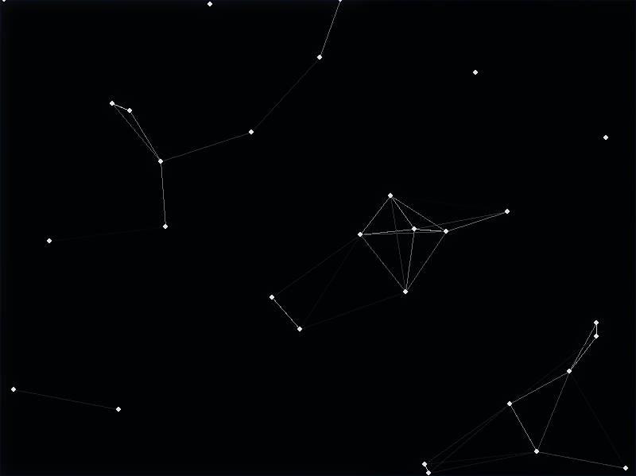
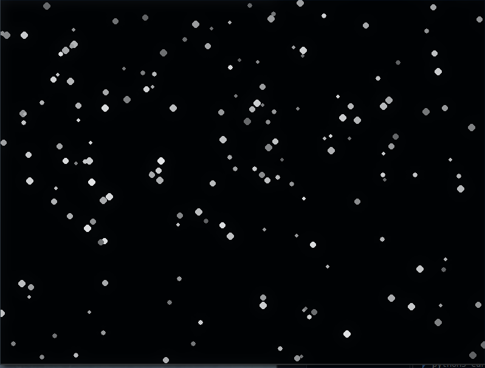
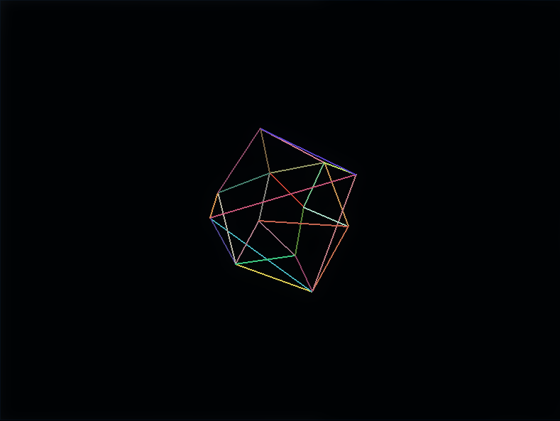

# demos
On PyGame
---


**abstract network animation**


---
**snow animation**


---

**3d animation**


---
**pixel animation**

---

# Run/Запуск
```bash
git clone https://github.com/vncased/demos.git
```
```bash
cd demos
```
```bash
pip install pygame
```
**Windows**
```bash
python curs.py
```
**Linux**
```bash
python3 curs.py
```
