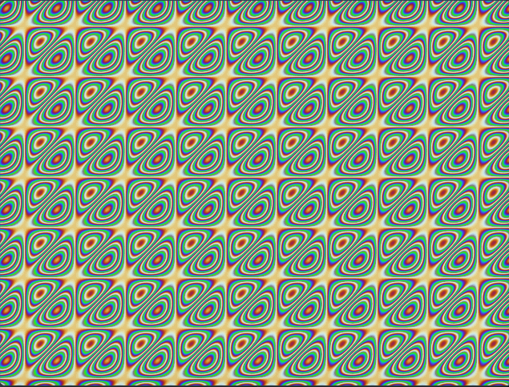

# demos
On PyGame
---

**abstract network animation**

[gif](https://github.com/vncased/demos/blob/main/demos/.img/ga.gif)
---
**snow animation**

[gif](https://github.com/vncased/demos/blob/main/demos/.img/snw.gif)
---

**3d animation**

[gif](https://github.com/vncased/demos/blob/main/demos/.img/tdg.gif)
---
**pixel animation**

[gif](https://github.com/vncased/demos/blob/main/demos/.img/pyl.gif)
---
**plasm animation**

---
# Run/Запуск

python3 curs.py
